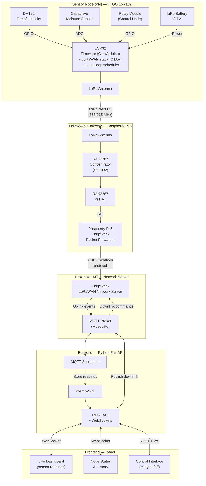

# LoRaWAN System Diagram

## Protocol Stack

| Layer | Technology |
|---|---|
| RF | LoRa (spread spectrum) |
| MAC | LoRaWAN Class A (OTAA) |
| Transport (GW→NS) | UDP Semtech packet forwarder |
| Network Server | ChirpStack |
| App messaging | MQTT |
| API | HTTP REST + WebSockets |
| Frontend | React |

## Data Flow Summary

1. **Uplink**: Sensor reads → ESP32 encodes payload → LoRa TX → Gateway receives → Packet Forwarder → ChirpStack decodes → MQTT publish → FastAPI stores in PostgreSQL → WebSocket push → React dashboard
2. **Downlink**: User clicks control in React → REST call to FastAPI → MQTT publish → ChirpStack queues downlink → Gateway transmits → ESP32 toggles relay
